# Framework de Preparação, Implementação e Review
## Guia funcional e lógico para humanos e IA

Este `README.md` é a porta de entrada de tudo que vive em `docs/`. Ele descreve **o que o framework é**, **como usá-lo**, **em que ordem** e **quais controles impedem que uma sessão de IA (ou operador humano) faça mais do que deveria**.

O framework foi construído a partir do repositório `MP-Trabalho/cidadania-canal-denuncias` (branch `stg`), mas é **reutilizável em qualquer projeto**: basta trocar a governança local e regenerar o pacote de preparação.

---

## 1. Estrutura de `docs/`

```
docs/
├── README.md                       ← você está aqui (guia de uso)
│
├── licoesaprendidas/               ← KIT canônico (fluxo, gates, templates, rules)
│   ├── README.md                   ← Passos 0–11 do fluxo com princípios não negociáveis
│   ├── 00..15-*.md                 ← controles reutilizáveis (drift, análise, gates, escalonamento, RCA, ...)
│   ├── templates/                  ← REQUIREMENTS, ANALYSIS, THREAT, EVIDENCE, ...
│   ├── skill/denuncias-quality-review/SKILL.md   ← skill Anthropic-style de review
│   └── scripts/preflight-denuncias.ps1           ← pre-flight read-only
│
├── preparacao-implementacao/       ← PACOTE gerado para o projeto atual (Passos 0–4 + 12)
│   ├── README.md                   ← índice + mapa Passo → artefato
│   ├── PROJECT_CONTEXT.md          ← contexto executivo em 2 páginas
│   ├── 00-MAPA-ORIGENS.md
│   ├── 01-ANALYSIS.md · 02-PRE-FLIGHT.md · 03-TOOLS.md · 04-MCP.md
│   ├── 05-PRD.md · 06-REQUIREMENTS.md · 07-TRACEABILITY.md
│   ├── 08-TDD.md · 09-THREAT-MODEL.md · 10-EVIDENCE-MANIFEST.md
│   ├── 11-IMPLEMENTATION-PLAN.md · 12-DECISIONS.md
│   ├── 13-PROMPTS.md               ← prompt pronto por Passo (0–12)
│   ├── 14-PROMPTS-EXECUCAO-COM-DIAGRAMAS.md   ← versão consolidada com diagramas
│   ├── skills/denuncias-preparacao-implementacao/SKILL.md
│   └── agents/                     ← analyst-preflight, requirements-engineer,
│                                     security-architect, evidence-planner,
│                                     plan-decomposer, diagram-curator
│
├── diagramas-mermaid/              ← 10 .mmd (C4 + comportamentais) + validador
│   ├── README.md                   ← padrão editorial (C4, cores, accTitle/accDescr)
│   ├── 01..10-*.mmd
│   └── validate-diagrams.js
│
├── Analises/                       ← relatórios históricos datados (fonte 2)
└── DiagramaDenuncias*.drawio       ← draw.io sobreposto aos .mmd
```

Precedência de fontes (regra do kit):

1. **Fonte primária atual** do projeto (`<projeto>/AGENTS.md`, `planejamento.md`, `spec_design.md`, código, testes, Swagger).
2. Relatórios em `Analises/*.md` (data declarada).
3. Publicações `.docx` derivadas de `build_*_docx.py` em `Analises/`.
4. Kit em `licoesaprendidas/` — **controles reutilizáveis**, não é fonte de fato.
5. Pacote em `preparacao-implementacao/` — leitura consolidada; **não substitui** a fonte primária.

Qualquer alegação materializada em fatia do plano exige reabertura da fonte primária.

---

## 2. Fluxo canônico

```
DISCOVER → ANALYZE → READINESS → PLAN → IMPLEMENT → TEST → REVIEW → SECURITY/QA → ACCEPTANCE → DELIVER → LESSONS LEARNED
   0          1          1        2/3/4    5          6         8            6/8            9              9              10/11
                                                                                                                            + 12 (diagramas)
```

Três momentos, três eixos que **não se sobrepõem**:

| Momento | Passos | Objetivo | Onde vive |
| --- | --- | --- | --- |
| **Antes do trabalho** | 0–4 | descobrir, analisar, decidir readiness, planejar | `preparacao-implementacao/00..12-*.md` |
| **Durante** | 5–8 | implementar fatia autorizada, testar, capturar evidência, review adversarial | `preparacao-implementacao/13-PROMPTS.md` §5..8 |
| **Depois** | 9–11 | entregar, RCA, evoluir governança | `preparacao-implementacao/13-PROMPTS.md` §9..11 |
| **Extensão** | 12 | sincronizar diagramas Mermaid + draw.io com o commit | `preparacao-implementacao/13-PROMPTS.md` §12 |

---

## 3. Como passar um projeto/desafio como input

O framework consome **três artefatos** — não parâmetros:

| Input | Onde | Papel |
| --- | --- | --- |
| **Codebase** | pasta no workspace (`<seu-projeto>/`) | fonte primária de fato |
| **Governança local** | `<seu-projeto>/AGENTS.md` (+ camadas) | autoridade que o kit **não** sobrescreve |
| **Kit + preparação** | `docs/licoesaprendidas/` + `docs/preparacao-implementacao/` + `docs/diagramas-mermaid/` | controles, templates, prompts, skill, subagentes |

### Onboarding em 5 passos

1. Coloque o repositório no workspace ao lado das pastas do framework:

   ```
   <workspace>/
     <seu-projeto>/          ← codebase
     docs/
       licoesaprendidas/     ← kit
       preparacao-implementacao/   ← será regenerado para o seu projeto
       diagramas-mermaid/    ← templates C4 (opcional)
   ```

2. Garanta `AGENTS.md` na raiz do seu projeto com: comandos, guardrails, arquitetura, convenções, pitfalls. Sem ele, o Passo 0 para em `NÃO FOI POSSÍVEL DETERMINAR`.

3. **Adapte a skill** copiando `skills/denuncias-preparacao-implementacao/SKILL.md` e ajustando só o cabeçalho YAML:

   ```yaml
   ---
   name: <seu-projeto>-preparacao-implementacao
   description: Prepara — sem alterar código — o <seu-projeto> para implementação. Executa os Passos 0 a 4 do kit docs/licoesaprendidas/ ...
   ---
   ```

   Substitua `cidadania-canal-denuncias/` → `<seu-projeto>/` na skill e nos subagentes em `agents/`.

4. **Defina o desafio** em uma linha em `PROJECT_CONTEXT.md` (ex.: "corrigir P0 de LGPD", "adicionar feature X", "migrar de fetch para HttpClient"). Isso amarra os prompts a um resultado esperado.

5. **Nomeie owners** (Produto, Segurança, DPO, Infra, QA, Integração). Sem owner competente, os Passos 4/5/8/9 param.

---

## 4. Sequência operacional de prompts (ponta a ponta)

Cada prompt de [`preparacao-implementacao/13-PROMPTS.md`](preparacao-implementacao/13-PROMPTS.md) é **uma sessão de IA** (ou uma execução de subagente). Não misture Passos numa só rodada.

### Fase A — Preparação (Passos 0–4)

| # | Prompt em `13-PROMPTS.md` | Entrada material | Saída obrigatória | Gate |
| ---: | --- | --- | --- | --- |
| A0 | `#passo-0` | codebase + `AGENTS.md` + kit | `00-MAPA-ORIGENS.md` | fontes com precedência |
| A1 | `#passo-1` — `analyst-preflight` | terminal autorizado; `07-preflight.md` do kit | `02-PRE-FLIGHT.md` + decisão `GO / GO COM RISCOS / NO-GO` | Gate 0 |
| A2 | `#passo-1` — tools/MCP | inventário do ambiente | `03-TOOLS.md` + `04-MCP.md` | Gate 0 |
| A3 | `#passo-2` — `requirements-engineer` | código + testes + Swagger/OpenAPI | `06-REQUIREMENTS.md` + `07-TRACEABILITY.md` | Gate 1 |
| A4 | `#passo-2` — PRD | requisitos + `AGENTS.md` | `05-PRD.md` | Gate 1 |
| A5 | `#passo-3` — TDD | topologia observada | `08-TDD.md` | Gate 2 |
| A6 | `#passo-3` — `security-architect` | perímetro + upload + integrações | `09-THREAT-MODEL.md` | Gate 2 |
| A7 | `#passo-3` — `evidence-planner` | requisitos | `10-EVIDENCE-MANIFEST.md` | Gate 2 |
| A8 | `#passo-4` — `plan-decomposer` | requisitos + threat model | `11-IMPLEMENTATION-PLAN.md` com fatias | DoR |
| A9 | `#passo-4` — decisões | reunião com owners | `12-DECISIONS.md` com DEC-* fechadas | DoR |

**Ponto de decisão humana antes de sair da Fase A**: se algum Gate 0/1/2 não fecha, **não** avance. Escalone via [`licoesaprendidas/10-escalonamento.md`](licoesaprendidas/10-escalonamento.md).

### Fase B — Implementação por fatia (Passo 5)

Repita B0→B4 **para cada fatia** de `11-IMPLEMENTATION-PLAN.md`, na ordem sugerida (blocos `A → B/C/D/E → F → G` do plano de exemplo).

| # | Prompt | Ação | Gate |
| ---: | --- | --- | --- |
| B0 | pedir autorização just-in-time ao owner da fatia (humano) | registrar em `12-DECISIONS.md` | DoR da fatia |
| B1 | `#passo-5` — informe `<ID>` da fatia (ex.: `B1`, `C2`) | escrever teste focal **vermelho** primeiro | R-QA-01 |
| B2 | mesmo prompt | aplicar menor mudança coerente até teste focal ficar verde | R-INC-01 |
| B3 | `#passo-6` | rodar suítes na ordem (focal → camada → lint → integ → E2E → sec/a11y) | Gate 4 |
| B4 | `#passo-7` | capturar/sanitizar evidência conforme shot list | Gate 4 |

### Fase C — Review adversarial (Passo 8)

Executar em sessão de IA **independente** (novo contexto, sem histórico de A/B) para evitar viés circular.

| # | Prompt | Ação | Gate |
| ---: | --- | --- | --- |
| C1 | `#passo-8` | reabrir fonte primária + tentar refutar prontidão | Gate 5 |
| C2 | revisor humano assina findings e decide **ENTREGAR / CORRIGIR / BLOQUEAR** | — | Gate 6 (Sec/QA) |

Se `CORRIGIR`, voltar a **B1** só para a fatia afetada.

### Fase D — Entrega + Aprendizado + Diagramas (Passos 9–12)

| # | Prompt | Ação | Autorização |
| ---: | --- | --- | --- |
| D1 | `#passo-9` | confirmar DoD, target, branch, remote, rollback | owner do repo/ambiente |
| D2 | owner humano executa `commit → push → PR → merge → deploy` | verificar destino após mutação | just-in-time por ação |
| D3 | `#passo-10` | reconstruir timeline, Five Whys, ações P0–P3 | — |
| D4 | `#passo-11` | promover aprendizado a controle verificável (rule/skill/agent) | curador do kit |
| D5 | `#passo-12` — `diagram-curator` | sincronizar `.mmd` + `.drawio` com o commit; rodar `validate-diagrams.js` | curador de arquitetura |

Passo 12 é obrigatório **antes do Passo 10**; recomendado após Passo 8 se o review indicar drift arquitetural; e antes do Passo 9 se a fatia mudar topologia/contrato.

### Fluxo condensado

```mermaid
flowchart LR
  Onboard["Onboarding:<br/>codebase + AGENTS.md +<br/>adaptar SKILL/PROJECT_CONTEXT"] --> A0

  subgraph FaseA["Fase A — Preparação (0–4)"]
    A0["Passo 0<br/>mapa/drift"] --> A1["Passo 1.1<br/>pre-flight"]
    A1 --> A2["Passo 1.2<br/>tools/MCP"]
    A2 --> A3["Passo 2.1<br/>requisitos"]
    A3 --> A4["Passo 2.2<br/>PRD"]
    A4 --> A5["Passo 3.1<br/>TDD"]
    A5 --> A6["Passo 3.2<br/>threat"]
    A6 --> A7["Passo 3.3<br/>evidência"]
    A7 --> A8["Passo 4.1<br/>plano"]
    A8 --> A9["Passo 4.2<br/>decisões"]
  end

  A9 --> Gate012{Gates 0/1/2<br/>fechados?}
  Gate012 -- não --> Escalonar["Escalonar<br/>10-escalonamento.md"]
  Gate012 -- sim --> LoopFatia

  subgraph FaseB["Fase B — por fatia (5–7)"]
    LoopFatia["Autorizar fatia N"] --> B1["Passo 5<br/>teste vermelho"]
    B1 --> B2["Passo 5<br/>correção mínima"]
    B2 --> B3["Passo 6<br/>testar por modo"]
    B3 --> B4["Passo 7<br/>evidência"]
  end

  B4 --> C1["Passo 8<br/>review independente"]
  C1 -- CORRIGIR --> B1
  C1 -- BLOQUEAR --> Escalonar
  C1 -- ENTREGAR --> D1["Passo 9<br/>entrega"]
  D1 --> D5["Passo 12<br/>diagramas"]
  D5 --> D3["Passo 10<br/>RCA"]
  D3 --> D4["Passo 11<br/>governança"]
```



---

## 5. Separação de responsabilidades

O framework separa análise, implementação e review em eixos que **não se contaminam**.

### 5.1 Análise + Plano (Passos 0–4)

Descobrir estado, reconstruir requisitos, modelar arquitetura/segurança e planejar fatias **sem tocar em código**.

| Camada | Artefato | Prompt |
| --- | --- | --- |
| Descoberta / estado | `00-MAPA-ORIGENS.md` | Passo 0 |
| Análise inicial + readiness | `01-ANALYSIS.md`, `02-PRE-FLIGHT.md`, `03-TOOLS.md`, `04-MCP.md` | Passo 1.1 + 1.2 |
| Requisitos (produto) | `05-PRD.md`, `06-REQUIREMENTS.md`, `07-TRACEABILITY.md` | Passo 2 |
| Arquitetura + segurança + evidência (modelagem) | `08-TDD.md`, `09-THREAT-MODEL.md`, `10-EVIDENCE-MANIFEST.md` | Passo 3 |
| Plano incremental + decisões | `11-IMPLEMENTATION-PLAN.md`, `12-DECISIONS.md` | Passo 4 |

Subagentes: `analyst-preflight`, `requirements-engineer`, `security-architect`, `evidence-planner`, `plan-decomposer` — todos com **arquivos de escrita exclusivos** e proibição explícita de alterar código.

### 5.2 Implementação (Passo 5)

Aplicar mudança de **uma fatia autorizada** do plano.

- Único prompt que pode alterar código: [`preparacao-implementacao/13-PROMPTS.md#passo-5`](preparacao-implementacao/13-PROMPTS.md#passo-5--implementar-fora-deste-pacote-prompt-de-referência).
- Restrito aos arquivos declarados **na fatia**.
- Regras vinculadas: `R-INC-01` (menor mudança), `R-SCOPE-01` (sem refactor oportunista), `R-QA-01` (teste focal vermelho antes de corrigir), `R-SEC-01` (sem PII/secret em logs), `R-LOOP-01` (parar em 2 falhas iguais sem nova hipótese).
- Vetos ainda ativos: `commit/push/deploy/live-*` sem autorização adicional.
- Owner: definido por bloco em `11-IMPLEMENTATION-PLAN.md §Dependências, owners e autorizações`.

### 5.3 Review — QA + Testes + Segurança/Compliance (Passos 6–8)

Cada disciplina tem seu Passo próprio para evitar validação circular.

| Disciplina | Passo | Artefato / template | Modo válido |
| --- | --- | --- | --- |
| **Testes por modo** (QA técnico) | 6 | `licoesaprendidas/06-gates-qa-testes-seguranca.md`, `07-TRACEABILITY.md` | unit, integ-sim, E2E-mock, live-BFF autorizado, live-MPT autorizado, UI-manual |
| **Evidência sanitizada** | 7 | `10-EVIDENCE-MANIFEST.md` + shot list | content freeze + redaction + fixtures sintéticas |
| **Review adversarial** (QA + segurança + a11y + privacidade) | 8 | `licoesaprendidas/templates/review.md` | leitura independente da fonte primária; **não** recebe a conclusão desejada |
| **Gates Segurança/QA/A11Y** | integrados 6/8 | `06-gates-qa-testes-seguranca.md §Gate de segurança / §Gate de QA/a11y` + `09-THREAT-MODEL.md` | fail-closed em prod; axe crítico = 0; teste manual AT |
| **Compliance / LGPD** | 2 → 3 → 8 | RNF-PRV-01 em `06-REQUIREMENTS.md`; T-DEN-01/14 em `09-THREAT-MODEL.md`; DEC-03/06/07 em `12-DECISIONS.md` | evidência sanitizada + aceite humano (DPO) |

### 5.4 Diagramas (Passo 12)

Sincronizar os 10 `.mmd` e o `.drawio` com o commit. Executa `node docs/diagramas-mermaid/validate-diagrams.js` como gate estrutural.

Subagente: `diagram-curator`. Fonte editorial: [`diagramas-mermaid/README.md`](diagramas-mermaid/README.md) (padrão C4, cores, `accTitle`/`accDescr`, premissas — BFF como unidade implantável, sem persistência inventada).

### 5.5 Como as camadas não se contaminam

1. **Contexto isolado por Passo**: cada prompt declara autorização vigente + arquivos de escrita exclusivos + ações proibidas.
2. **Rastreabilidade única**: `07-TRACEABILITY.md` liga requisito → artefato → **modo de teste** → resultado → evidência → owner. Modos não são intercambiáveis (`E2E-mock` ≠ `live-*`).
3. **Gates do kit** ([`06-gates-qa-testes-seguranca.md`](licoesaprendidas/06-gates-qa-testes-seguranca.md)):
   - Gate 0/1/2 fecham **antes** de Gate 3 (implementação).
   - Gate 4 (testing), Gate 5 (review), Gate 6 (security/QA) são independentes; cada um pode bloquear.
   - Gate 7 (delivery) só abre com DoD completo + autorização just-in-time.
4. **Review adversarial** (Passo 8) parte da **fonte primária**, não da conclusão do implementador — regra `R-REV-01`.
5. **Compliance/DPO** é decisão material (DEC-03, DEC-06, DEC-07) e bloqueia fatias específicas até assinatura.

---

## 6. O que cada prompt pode e não pode fazer

Padrão de segurança presente em **todos** os prompts:

- Autorização vigente declarada no início (padrão: **somente leitura/documentação**).
- Ações destrutivas ou de rede exigem autorização **just-in-time** — não vêm com o prompt.
- Critério de parada explícito (`escopo expande`, `autorização insuficiente`, `duas falhas iguais sem hipótese nova`, `suspeita de secret/PII`, etc.).

Tabela resumo:

| Prompt (§ em `13-PROMPTS.md`) | Escreve em | Toca em `<seu-projeto>/**`? |
| --- | --- | --- |
| Passo 0 | `00-MAPA-ORIGENS.md` | ❌ leitura |
| Passo 1.1 (`analyst-preflight`) | `01-ANALYSIS.md`, `02-PRE-FLIGHT.md`, `03-TOOLS.md`, `04-MCP.md` | ❌ apenas comandos read-only (`git status`, `node --version`, `rg`); vetados `npm install/ci`, `npm audit`, `playwright install`, `git commit/push`, chamadas a serviços live |
| Passo 1.2 (tools/MCP) | `03-TOOLS.md`, `04-MCP.md` | ❌ leitura |
| Passo 2.1 (`requirements-engineer`) | `06-REQUIREMENTS.md`, `07-TRACEABILITY.md` | ❌ leitura |
| Passo 2.2 (PRD) | `05-PRD.md` | ❌ leitura |
| Passo 3.1 (TDD) | `08-TDD.md` | ❌ leitura |
| Passo 3.2 (`security-architect`) | `09-THREAT-MODEL.md` | ❌ leitura; veto a DAST/pentest/leitura de secret |
| Passo 3.3 (`evidence-planner`) | `10-EVIDENCE-MANIFEST.md` | ❌ leitura |
| Passo 4.1 (`plan-decomposer`) | `11-IMPLEMENTATION-PLAN.md` | ❌ leitura |
| Passo 4.2 (decisões) | `12-DECISIONS.md` | ❌ leitura |
| **Passo 5 (implementar)** | referência — só executa se o **owner autorizar a fatia específica** | ✅ **somente após autorização just-in-time** e restrito aos arquivos declarados na fatia |
| Passo 6 (testar) | template de teste + `07-TRACEABILITY.md` | ❌ código; ✅ suítes locais (unit/integ-sim/E2E-mock). Live-* exige autorização adicional |
| Passo 7 (evidência) | shot list em `10-EVIDENCE-MANIFEST.md` | ❌ leitura + captura em ambiente autorizado com redaction obrigatória |
| Passo 8 (review) | `licoesaprendidas/templates/review.md` | ❌ **somente leitura** — revisão adversarial independente |
| Passo 9 (entrega) | comunicado de release | ❌ código; commit/push/deploy exigem autorização explícita do owner |
| Passo 10 (RCA) | `licoesaprendidas/templates/lessons-learned.md` | ❌ leitura |
| Passo 11 (governança) | `licoesaprendidas/templates/*.md` ou `skill/*/SKILL.md` | ❌ código do produto |
| Passo 12.1 (`diagram-curator`) | `diagramas-mermaid/*.mmd` + `DiagramaDenuncias-sobreposto.drawio` | ❌ código do produto |
| Passo 12.2 (validador) | — | ❌ somente executa `node validate-diagrams.js` |

Portanto: o único prompt que **pode** alterar código do produto é o do **Passo 5**, e mesmo assim exige owner + autorização just-in-time + fatia específica.

---

## 7. Regras práticas para não quebrar o fluxo

1. **Uma sessão de IA = um Passo**. Não peça Passo 3 e 5 no mesmo prompt.
2. **Autorização é por ação**, não por plano. Aprovar A8 (plano) **não** autoriza B1 (implementação).
3. **Review em contexto novo** (Fase C) — nunca no mesmo chat que implementou (evita validação circular).
4. **Duas falhas iguais sem nova hipótese** durante B1/B2 → pare e volte para A3 ou A6 (requisito ou threat pode estar errado). Regra `R-LOOP-01`.
5. **Reexecute A1 (pre-flight)** sempre que muda runtime, lockfile, CI ou branch.
6. **Owner pendente = fatia bloqueada.** Nada implementa sem owner em `12-DECISIONS.md`.
7. **Números com data.** Nunca cite bundle/latência/cobertura sem `commit + data + comando`.
8. **Não decida conflito material sozinho** (D-01..D-12, DEC-01..DEC-10). Owner competente decide.
9. **Preserve `AGENTS.md` do projeto** como autoridade. Templates aqui são propostas.
10. **Segredo suspeito → parar imediatamente** e escalar. Não inclua em log, prompt, artifact.

---

## 8. Recursos de automação

### 8.1 Skills (padrão Anthropic Claude Skills)

| Skill | Papel | Instalação |
| --- | --- | --- |
| [`preparacao-implementacao/skills/denuncias-preparacao-implementacao/SKILL.md`](preparacao-implementacao/skills/denuncias-preparacao-implementacao/SKILL.md) | orquestra Passos 0–4 e 12 | referência local; opcional em `~/.claude/skills/` ou `.copilot/skills/` após auditoria |
| [`licoesaprendidas/skill/denuncias-quality-review/SKILL.md`](licoesaprendidas/skill/denuncias-quality-review/SKILL.md) | review baseado em evidências (Passo 8) | idem |

Instalar uma skill em plataforma de IA aumenta superfície de risco: siga a auditoria de [`licoesaprendidas/04-ia-rules-skills-tools-mcp-agents.md`](licoesaprendidas/04-ia-rules-skills-tools-mcp-agents.md).

### 8.2 Subagentes

Definidos em [`preparacao-implementacao/agents/`](preparacao-implementacao/agents/). Cada um tem missão, arquivos read-only/exclusivos, ações proibidas, saída/evidência, critério de parada, integrador humano.

| Subagente | Missão |
| --- | --- |
| [`analyst-preflight`](preparacao-implementacao/agents/analyst-preflight.md) | pre-flight read-only + atualização de `01-ANALYSIS.md`/`02-PRE-FLIGHT.md`/`03-TOOLS.md`/`04-MCP.md` |
| [`requirements-engineer`](preparacao-implementacao/agents/requirements-engineer.md) | reengenharia detalhada; requisitos atômicos com aceite |
| [`security-architect`](preparacao-implementacao/agents/security-architect.md) | threat model frente a mudança de fluxo/upload/integração |
| [`evidence-planner`](preparacao-implementacao/agents/evidence-planner.md) | manifesto de evidências, shot list, retenção, redaction |
| [`plan-decomposer`](preparacao-implementacao/agents/plan-decomposer.md) | quebra fatias grandes em micro-fatias reversíveis |
| [`diagram-curator`](preparacao-implementacao/agents/diagram-curator.md) | sincroniza 10 `.mmd` + `.drawio`; roda `validate-diagrams.js` |

### 8.3 Scripts

- [`licoesaprendidas/scripts/preflight-denuncias.ps1`](licoesaprendidas/scripts/preflight-denuncias.ps1) — pre-flight read-only (não autentica, não instala).
- [`diagramas-mermaid/validate-diagrams.js`](diagramas-mermaid/validate-diagrams.js) — valida presença dos 10 `.mmd`, cabeçalhos Mermaid, ausência de tabulação e integridade do `.drawio`.

---

## 9. Como usar como humano

1. Abra o workspace no VS Code (ou editor equivalente).
2. Leia [`licoesaprendidas/README.md`](licoesaprendidas/README.md) integralmente (uma vez por ciclo).
3. Preencha [`preparacao-implementacao/PROJECT_CONTEXT.md`](preparacao-implementacao/PROJECT_CONTEXT.md) com objetivo do ciclo e owners.
4. Rode manualmente o pre-flight ([`licoesaprendidas/07-preflight.md`](licoesaprendidas/07-preflight.md)) ou execute o script.
5. Trabalhe em sequência A → B → C → D usando os prompts como roteiro.
6. Ao autorizar uma fatia, registre em `12-DECISIONS.md` **antes** de iniciar o Passo 5.
7. Após entrega, execute Passo 12 (curadoria de diagramas) e depois Passos 10–11.

---

## 10. Como usar como IA (Copilot / Claude / Codex / outro agente)

1. Ao iniciar uma sessão, leia:
   - Este `README.md`.
   - `preparacao-implementacao/README.md`.
   - O Passo específico do ciclo em [`licoesaprendidas/README.md`](licoesaprendidas/README.md).
   - `AGENTS.md` do projeto.
2. Cole o prompt do Passo pretendido de [`preparacao-implementacao/13-PROMPTS.md`](preparacao-implementacao/13-PROMPTS.md).
3. Respeite:
   - Autorização vigente declarada no prompt.
   - Arquivos de escrita exclusivos por subagente.
   - Ações proibidas listadas.
   - Critério de parada.
4. Ao final da rodada, entregue:
   - Fontes consultadas.
   - Comandos executados (se algum).
   - Alterações realizadas.
   - Evidências (sanitizadas).
   - Limitações + riscos.
   - Decisão do gate.
   - Próximo passo autorizado.
5. Se detectar exposição de PII/segredo, drift material ou conflito de requisito sem owner: **pare**, registre e escale ao humano.

Prompt mestre para coordenador consciente do fluxo: veja [`preparacao-implementacao/14-PROMPTS-EXECUCAO-COM-DIAGRAMAS.md §Prompt mestre`](preparacao-implementacao/14-PROMPTS-EXECUCAO-COM-DIAGRAMAS.md).

---

## 11. Sinal de "acabou"

Considere o desafio **entregue** quando **todos** estes forem verdade:

- Requisitos críticos (`P0`+`P1`) em [`07-TRACEABILITY.md`](preparacao-implementacao/07-TRACEABILITY.md) com `Resultado=OK` e evidência sanitizada anexa.
- [`09-THREAT-MODEL.md`](preparacao-implementacao/09-THREAT-MODEL.md) fechado como `APROVADO` ou `APROVADO COM RISCO` documentado.
- Gate 7 (Delivery) assinado por owner humano após verificação do destino.
- Post-mortem (Passo 10) registrado.
- Aprendizados que viraram controle promovidos no Passo 11.
- Diagramas atualizados e validador OK (Passo 12).

Se qualquer item ficar aberto, a solução **não** está "implementada" — está em andamento.

---

## 12. Reutilizar em outro projeto

```powershell
Copy-Item -Recurse f:\ProjetosMPT\denuncias2\docs\licoesaprendidas         <novo-repo>\docs\
Copy-Item -Recurse f:\ProjetosMPT\denuncias2\docs\preparacao-implementacao <novo-repo>\docs\
Copy-Item -Recurse f:\ProjetosMPT\denuncias2\docs\diagramas-mermaid        <novo-repo>\docs\
```

Depois no destino:

1. Renomeie a skill (`name:` + `description:` em `SKILL.md`).
2. Substitua caminhos `cidadania-canal-denuncias/**` → `<seu-projeto>/**` nos subagentes e prompts.
3. Regenere `PROJECT_CONTEXT.md`, `00-MAPA-ORIGENS.md` e demais artefatos executando A0–A9.
4. Redesenhe (ou apague) os 10 `.mmd` conforme sua arquitetura; ajuste [`diagramas-mermaid/README.md`](diagramas-mermaid/README.md) se mudar padrão editorial.
5. Ajuste [`licoesaprendidas/00-mapa-origens-baseline-drift.md`](licoesaprendidas/00-mapa-origens-baseline-drift.md) e [`15-baseline-analises-denuncias.md`](licoesaprendidas/15-baseline-analises-denuncias.md) para refletir suas fontes históricas.

---

## 13. Limitações do framework

- Documentação estática pode envelhecer; sempre reabra a fonte primária antes de citar comportamento.
- Instalar skill/MCP em plataforma de IA aumenta superfície de risco.
- Testes com mock/interceptação **não** provam integração live.
- Automação de acessibilidade (axe) **não** garante conformidade WCAG completa.
- `npm audit`, SAST, DAST, antivírus têm falsos positivos e negativos.
- Ferramenta configurada ≠ autenticada; autenticada ≠ autorizada.
- Owner competente é insubstituível: sem ele, gates críticos permanecem abertos.

---

## 14. Referências rápidas

| Você quer… | Vá para |
| --- | --- |
| Entender o fluxo canônico | [`licoesaprendidas/README.md`](licoesaprendidas/README.md) |
| Ver os controles e templates | [`licoesaprendidas/`](licoesaprendidas/) |
| Rodar o pre-flight | [`licoesaprendidas/07-preflight.md`](licoesaprendidas/07-preflight.md) + [`scripts/preflight-denuncias.ps1`](licoesaprendidas/scripts/preflight-denuncias.ps1) |
| Iniciar um ciclo | [`preparacao-implementacao/README.md`](preparacao-implementacao/README.md) |
| Copiar um prompt pronto | [`preparacao-implementacao/13-PROMPTS.md`](preparacao-implementacao/13-PROMPTS.md) |
| Ver a versão consolidada com diagramas | [`preparacao-implementacao/14-PROMPTS-EXECUCAO-COM-DIAGRAMAS.md`](preparacao-implementacao/14-PROMPTS-EXECUCAO-COM-DIAGRAMAS.md) |
| Consultar/atualizar diagramas | [`diagramas-mermaid/README.md`](diagramas-mermaid/README.md) |
| Consultar relatórios históricos | [`Analises/`](Analises/) |
| Escalonar impasse | [`licoesaprendidas/10-escalonamento.md`](licoesaprendidas/10-escalonamento.md) |
